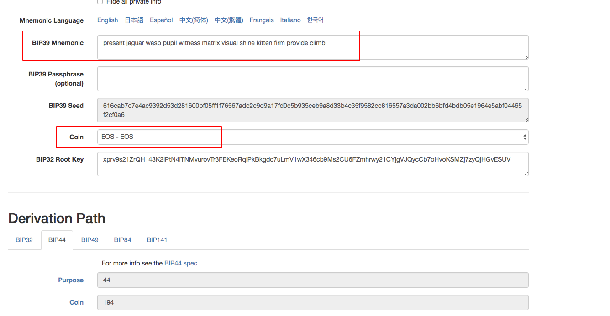
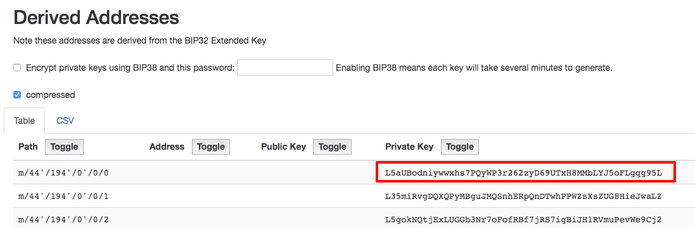
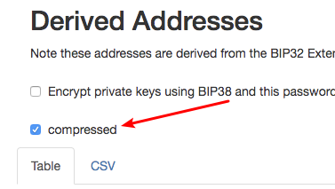

# EOS 助记词生成私钥工具 (BIP39/44 标准)
`Forked from https://github.com/iancoleman/bip39`

**只是在 [iancoleman/bip39](https://github.com/iancoleman/bip39 ) 的基础上，新增了 EOS 币种**

# 使用方式
1. 访问在线版：[bip39-standalone.html](https://static.zhusun.in/bip39-standalone.html) 如果担心安全问题可以下载项目中的 **bip39-standalone.html** 源文件离线使用
2. 双击用浏览器打开。可以直接断网离线使用(如果不放心)
3. 『BIP39 Mnemonic』 填入助记词，『Coin』 类型选择 EOS-EOS



4. 在下方 Private Key 即可获得主路径的 EOS 私钥 （第一行的就是）



**PS: 新增了一个可选是否开启wif压缩的功能**




# 为什么要加入 EOS 币种？
为了做 EOS 合约开发，用了[番茄钱包](https://tomatowallet.cn) 注册EOS 账户。

虽然直接用微信支付开户挺方便 ，无奈官方说为了用户的私钥安全，只支持助记词导出。

研究了一下他们 **助记词->私钥** 的逻辑，其实就是把 coinID 置为 EOS 的，各种google之后得知 EOS 的 ID 是194，就改进了一下这个小工具，让它支持 EOS 币种了


# 感谢
https://github.com/iancoleman/bip39 作者


--------

## 以下是项目原 README

--------

# BIP39 Tool

A tool for converting BIP39 mnemonic phrases to addresses and private keys.

## Online Version

https://iancoleman.io/bip39/

## Standalone offline version

Download `bip39-standalone.html`

Open the file in a browser by double clicking it.

This can be compiled from source using the command `python compile.py`

## Usage

Enter your BIP39 phrase into the 'BIP39 Phrase' field, or press
'Generate Random Phrase'

If required, set the derivation path, although the defaults are quite usable.

See the table for a list of addresses generated from the phrase.

Toggle columns to blank to easily copy/paste a single column of data, eg to
import private keys into a wallet or supply someone with a list of addresses.

The BIP32 keys can be used at [bip32.org](https://bip32.org) if desired.

## Donations

Since this project is the efforts of many people, most of which don't appear in
the obvious places like code or issues, donating to the project itself causes
significant operational difficulties.

As a result, if you would like to support this project financially you are
encouraged to donate to one of the many groups that makes the internet a place
amenable to projects such as this one.

[Donation-accepting organizations and projects](https://en.bitcoin.it/wiki/Donation-accepting_organizations_and_projects)

If the list is too difficult to choose from, the EFF is a good choice.

[Electronic Frontier Foundation](https://supporters.eff.org/donate)

or for a direct bitcoin address, consider donating to the
[Free Software Foundation](https://www.fsf.org/about/ways-to-donate/)
at 1PC9aZC4hNX2rmmrt7uHTfYAS3hRbph4UN


## Making changes

Please do not make modifications to `bip39-standalone.html`, since they will
be overwritten by `compile.py`.

Make changes in `src/*`.

Changes are applied during release using the command `python compile.py`, so
please do not commit changes to `bip39-standalone.html`

# Tests

Tests depend on

* nodejs
* selenium webdriver - cd /path/to/bip39/tests; npm install
* selenium driver for firefox ([geckodriver](https://github.com/mozilla/geckodriver/releases)) and / or chrome ([chromedriver](https://sites.google.com/a/chromium.org/chromedriver/downloads))
* jasmine - npm install --global jasmine

Before running tests, the site must be served at http://localhost:8000.

```
$ cd /path/to/bip39/src
$ python -m http.server
```

Run tests from the command-line

```
$ cd /path/to/bip39/tests
$ jasmine spec/tests.js
```

# License

This BIP39 tool is released under the terms of the MIT license. See LICENSE for
more information or see https://opensource.org/licenses/MIT.
